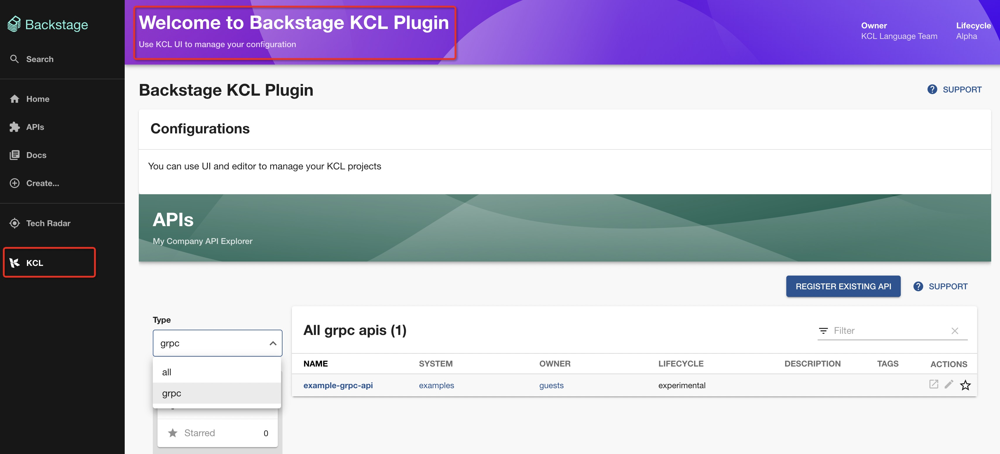

# Backstage KCL UI Plugin

Plugin implementation is [here](./plugins/backstage-kcl/)

> Note: This plugin is currently being designed and implemented, please do not use it in production environments.

## Usage

### Configure Your Backstage Instance

+ Add `@kcl-lang/plugin-backstage-kcl` dependency in your `package.json`.

```json
"@kcl-lang/plugin-backstage-kcl": "*",
```

+ Add KCL page to sidebar

```diff
 // packages/app/src/components/Root/Root.tsx
+import { KCLLogo } from '@kcl-lang/plugin-backstage-kcl';

 export const Root = ({ children }: PropsWithChildren<{}>) => (
   <SidebarPage>
         {/* ... */}
         {/* End global nav */}
         <SidebarDivider />
         <SidebarScrollWrapper>
+          <SidebarItem icon={KCLLogo} to="backstage-kcl" text="KCL" />
         </SidebarScrollWrapper>
       {/* ... */}
   </SidebarPage>
 );
```

```diff
 // packages/app/src/App.tsx
+import { KCLPage } from '@kcl-lang/plugin-backstage-kcl';

 const routes = (
   <FlatRoutes>
     {/* ... */}
     <Route path="/settings" element={<UserSettingsPage />} />
     <Route path="/catalog-graph" element={<CatalogGraphPage />} />
+    <Route path="/backstage-kcl" element={<KCLPage />} />
     {/* ... */}
   </FlatRoutes>
 );
```

+ Run your Backstage instance and select the KCL sidebar.



### Prerequisites

- [Node.js Active LTS Release](https://github.com/nodejs/release#release-schedule)
- [yarn](https://classic.yarnpkg.com/en/docs/install)

### Change your code

## Developing

### Install Dependencies

You'll need to install dependencies before you can run the UI locally.

```bash
yarn install
```

### Running

```bash
yarn dev
```

### Testing

```bash
yarn test
```

### Linting

```bash
yarn lint
```

### Formatting

```bash
yarn prettier:check # Checks for any code formatting errors
yarn prettier:write # Formats code
```
